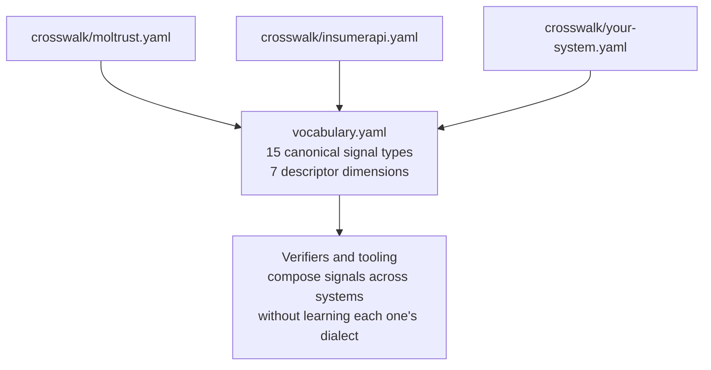

# Agent Governance Vocabulary

Agent Governance Vocabulary is a common reference for agent-governance systems. It maps how different systems name identity, authority, trust, receipts, replay, and other governance signals onto one canonical set of terms, without asking anyone to rename their own system.

Every system names its own primitives, so the same signal travels under many labels. Here are five systems in this registry that issue what is canonically `behavioral_trust`, each under a different name:

| System | Its own name for the signal | Match |
| --- | --- | --- |
| MolTrust | Swarm Intelligence Trust Score (Phase 2) | exact |
| AgentLair | Three-Dimensional Trust Score (RFC-003 Phase 2b) | exact |
| PathCourse | Path Score (0-850) | exact |
| Sovereign Atom | relationship.trust_score | exact |
| APS | ScopedReputation | partial |

The verifier reads all five and learns a single canonical name, `behavioral_trust`, in place of five. Each mapping is one row in that system's crosswalk file, and where the fit is not exact the row says so. APS exposes scoped-reputation primitives rather than one scored assessment, which is why its row is `partial` while the other four are `exact`.

## What a row looks like

```yaml
<signal>:
  canonical: <canonical name>
  internal: "<the system's own name for it>"
  match: exact | structural | partial | non_equivalent_similar_label | no_mapping
  signed_payload_fields: [ ... ]   # the fields the signature covers
```

The registry documents differences as carefully as matches. InsumerAPI's crosswalk maps `behavioral_trust` as `no_mapping`: it does not issue that signal, and the row says so instead of stretching a similar label to fit. Five match types carry this honesty: `exact`, `structural`, `partial`, `non_equivalent_similar_label`, `no_mapping`. The last two exist because false equivalence is the failure mode this layer prevents.

## How the pieces fit



Current corpus: 32 crosswalk files mapped against 15 canonical signal types. The full system-by-signal grid is at [`docs/generated/crosswalk-matrix.md`](./docs/generated/crosswalk-matrix.md).

**Precedent:** the IANA JWT claim registry and JSON-LD `@context`. Each system keeps its internal code and its production envelope values. This repo provides the shared reference and the per-system mappings.

## Who this is for

- **Building a verifier or gateway** that consumes signals from more than one issuer: read `vocabulary.yaml` for the canonical names, then the crosswalk for each system you accept.
- **Running a system that issues governance signals**: open a PR adding `crosswalk/<your-system>.yaml`. Partial and non-equivalent rows are encouraged; this layer exists to clarify differences, not hide them.
- **Writing a spec or standard** that references governance signal classes: cite the canonical names so implementations converge on one vocabulary instead of inventing a parallel one.

## Status

v0.2.0 draft. Open for Working Group review. Co-authored:

- [@aeoess](https://github.com/aeoess) - APS
- [@QueBallSharken](https://github.com/QueBallSharken) - descriptor dimensions, BBIS-aligned distinctions
- [@douglasborthwick-crypto](https://github.com/douglasborthwick-crypto) - InsumerAPI / SkyeProfile, scope layering
- [@MoltyCel](https://github.com/MoltyCel) - MolTrust / AAE, typed schema discipline
- WG members invited

## Layered scope

Three layers, distinct altitudes, cross-reference via this repo:

1. `vocabulary.yaml` - canonical names for abstract governance primitives (signal types, descriptor dimensions, match semantics)
2. `MULTI-ATTESTATION-SPEC.md` (lives in [insumer-examples](https://github.com/douglasborthwick-crypto/insumer-examples)) - canonical envelope `type` field values for multi-issuer verification
3. `crosswalk/<system>.yaml` - per-system mappings between internal names and canonical names

Renaming live signed envelope `type` values is explicitly out of scope - canonical aligns with what is already in production.

## Crosswalks

Open a PR adding `crosswalk/<your-system>.yaml`. Use the match types from `vocabulary.yaml > crosswalk_match_types`. Partial match and non-equivalent-similar-label are encouraged - this layer exists to clarify differences, not hide them.

See [`docs/generated/crosswalk-matrix.md`](./docs/generated/crosswalk-matrix.md) for the system × signal-type match grid across the corpus.

Committed contributors so far:

- `crosswalk/a2a.yaml` - @rnwy
- `crosswalk/aeoess-aps.yaml` - @aeoess (renamed from aps.yaml)
- `crosswalk/agent-did.yaml` - @edisonduran
- `crosswalk/agentgraph.yaml` - @kenneives
- `crosswalk/agentid.yaml` - @haroldmalikfrimpong-ops
- `crosswalk/agentlair.yaml` - @piiiico
- `crosswalk/agentnexus.yaml` - @kevinkaylie
- `crosswalk/aps-acta.yaml` - @aeoess (APS / ACTA receipt composition; ACTA-side review pending)
- `crosswalk/asqav.yaml` - @jagmarques
- `crosswalk/budget_reservation.yaml` - cap-type vocabulary, lead-authored by @amavashev (Cycles); Track B domain incubation
- `crosswalk/continuity-analyzer.yaml` - @nutstrut
- `crosswalk/cursor-hooks.yaml` - @aeoess (third-party crosswalk; authored by the maintainer, not by Cursor)
- `crosswalk/cycles.yaml` - @amavashev
- `crosswalk/dcp-ai.yaml` - @lktron00
- `crosswalk/fidelity-spec.yaml` - @lowkey-divine
- `crosswalk/insumerapi.yaml` - @douglasborthwick-crypto
- `crosswalk/jep.yaml` - @schchit
- `crosswalk/logpose.yaml` - @rkaushik29
- `crosswalk/moltrust.yaml` - @MoltyCel
- `crosswalk/mycelium-trails.yaml` - @giskard09 (Mycelium Trails / argentum-core; aeoess-drafted, Track B)
- `crosswalk/nobulex.yaml` - @arian-gogani
- `crosswalk/pathcourse-health.yaml` - @alex-pathcourse
- `crosswalk/pic.yaml` - @madeinplutofabio
- `crosswalk/rfc-category-taxonomy.yaml` - reverse crosswalk mapping
  the ten MULTI-ATTESTATION-SPEC signal_types to the (proposed) A2A
  RFC trust evidence category taxonomy. Drafted on
  @douglasborthwick-crypto's offer per A2A Discussion #1734
  ([@AlexanderLawson17](https://github.com/AlexanderLawson17)). Eight
  of ten rows currently need per-issuer field-set confirmation; see
  the file's `review_required` block for the tag list.
- `crosswalk/rnwy.yaml` - @rnwy
- `crosswalk/sar.yaml` - @nutstrut
- `crosswalk/satp/behavioral-trust.yaml` - @0xbrainkid
- `crosswalk/signet.yaml` - @willamhou
- `crosswalk/sint.yaml` - @pshkv
- `crosswalk/soulboundrobots.yaml` - @rnwy
- `crosswalk/sovereign-atom.yaml` - @AuthorPrime
- `crosswalk/veritasacta.yaml` - @tomjwxf

## Legacy descriptor overrides

`scripts/legacy-descriptor-overrides.yaml` lists known-stale `(file, path, value)` combinations from crosswalks that pre-date a vocabulary resolution. The validator emits warnings (not errors) for these so contributor CI doesn't break on unrelated PRs to those files. As maintainers update their crosswalks, entries are removed.

Do not add new entries without a tracked WG issue establishing the canonical resolution.

## License

Apache-2.0.
